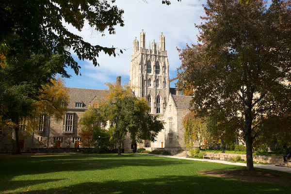
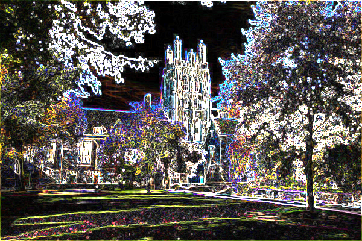
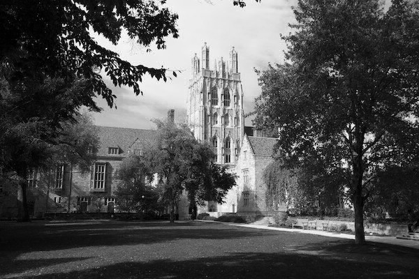
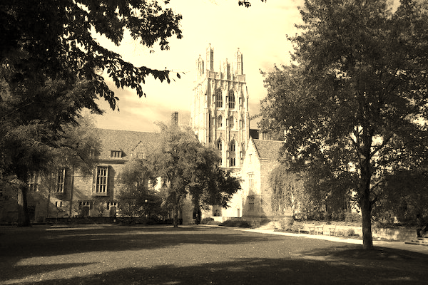

<p align="center">
  
</p>

<p align="center">
  
  
  
</p>


## Filter-Program
A program is written in C language so users can apply grayscale, sepia, reflection, blur, or edge detection filters to their images

## Requirements
Clang should be installed on your system

`$ sudo apt-get install clang`

## Build
Use the provided Makefile

`$ make`

## How to run the program
After running make, the program will be located in a directory called `bin`. It can be used like this

`$ ./filter [flag] infile outfile`


* Filter flags

`$ ./filter -h` or `$ ./filter --help`
```
Options available
-b     blur filter
-e     edges filter
-s     sepia filter
-g     greyscale filter
-r     reflected filter
```
* How to build the program 

`$ clang -ggdb3 -O0 -Qunused-arguments -std=c11 -Wall -Werror -Wextra -Wno-sign-compare -Wno-unused-parameter -Wno-unused-variable -Wshadow -lm -o filter filter.c helpers.c`

## Note

* Can only convert Bitmap images with specific format

`PC bitmap,Windows 3.x format, cbSize 720056, bits offset 54`

* Save output file with a bitmap file extention `.bmp`

* Example

`$ ./filter [FLAG] image.bmp out.bmp`

## Filter Snapshots
* Original Image



* Blur Filter


* Edge Detection Filter



* Greyscale Filter



* Reflected Filter


* Sepia Filter




## Author
* Bhaskar Pal - *Initial Work* - [bhaskarpal](https://github.com/onyx-storm) 

## License
* This project is licensed under the MIT License - see the [LICENSE.md](LICENSE) file for details
